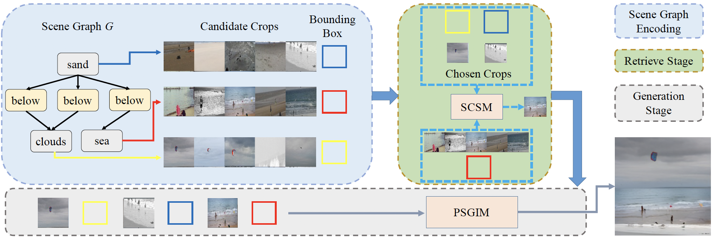
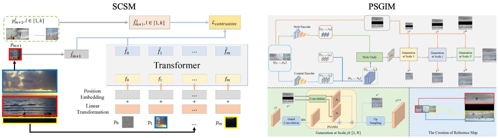

# scene-graph-to-image
This is a pytorch project for the paper **Hierarchical Image Generation via Transformer-Based Sequential Patch Selection** by Xiaogang Xu, Ning Xu presented at **AAAI2022**.


## Introduction
In this paper, we propose a novel framework with such a semi-parametric generation strategy. First, to encourage the retrieval of mutually compatible crops, we design a sequential selection strategy where the crop selection
for each object is determined by the contents and locations of all object crops that have been chosen previously. Such process is implemented via a transformer trained with contrastive
losses. Second, to generate the final image, our hierarchical generation strategy leverages hierarchical gated convolutions which are employed to synthesize areas not covered by any image
crops, and a patch-guided spatially adaptive normalization module which is proposed to guarantee the final generated images complying with the crop appearance and the scene graph.


The framework consists of two modules: SCSM and PSGIM

 

[paper link](https://github.com/xiaogang00/AAAI-Scene-Graph-to-Image/blob/main/figures/camera.pdf)

## Dataset
Please first download the datasets from [PasteGAN](https://github.com/yikang-li/PasteGAN), including COCO-Stuff and Visual Genome.
And then please process the data of COCO-Stuff following the instructions in "Data Preparation: pre-retrieve module".

## Train
The training is recommended to be run on GPU with memory of 16 GB.

### COCO-Stuff
Please modify the "path_to_coco" in coco5.py correspondingly.

1) To train the patch selection module on COCO-Stuff, use the command line:

```
CUDA_VISIBLE_DEVICES=0 python train_coco_selection.py --path_opt options/coco/coco_selection.yaml --batch_size 16 --learning_rate 0.0001
```

2) To train the generation module on COCO-Stuff, use the command line (please change the "path_to_trained_scsm" in train_coco_generation.py, and also change the "path_to_resume" if needed):

```
CUDA_VISIBLE_DEVICES=0,1,2,3 python train_coco_generation.py --path_opt options/coco/coco_generation.yaml --batch_size 12 --learning_rate 0.0001
```

### Visual Genome

1) To train the patch selection module on Visual Genome, use the command line:

```
CUDA_VISIBLE_DEVICES=0 python train_vg_selection.py --path_opt options/vg/vg_selection.yaml --batch_size 12 --learning_rate 0.0001
```

2) To train the generation module on Visual Genome, use the command line (please change the "path_to_trained_scsm" in train_vg_generation.py, and also change the "path_to_resume" if needed):

```
CUDA_VISIBLE_DEVICES=0,1,2,3 python train_vg_generation.py --path_opt options/vg/vg_generation.yaml --batch_size 12 --learning_rate 0.0001
```

## Inference

### COCO-Stuff
Please modify the "path_to_coco" in coco5.py correspondingly.

To inference the image generation/manipulation with the model on COCO-Stuff, use the command line (please change "the path of SCSM" and "the path of PSGIM" to the corresponding paths):

```
python test_coco.py --path_opt options/coco/coco_generation.yaml --batch_size 1
```

### Visual Genome

To inference the image generation/manipulation with the model on Visual Genome, use the command line (please change "the path of SCSM" and "the path of PSGIM" to the corresponding paths):

```
python test_vg.py --path_opt options/vg/vg_generation.yaml --batch_size 1
```


## Data Preparation: pre-retrieve module

If you want to compute the crops_pickle and object_index_mapping on COCO-Stuff, you should use the following command line (we do not use the segmentation on COCO-Stuff in this work, and you can delete the corresponding code in the dataloader):

```
cd sg2im-master

python sample_images_process.py --dataset coco --checkpoint sg2im-models/coco64.pt --output_dir outputs
```


## Citation Information

If you find the project useful, please cite:

```
@inproceedings{xu2022scene2graph,
  title={Hierarchical Image Generation via Transformer-Based Sequential Patch Selection},
  author={Xiaogang Xu, Ning Xu},
  booktitle={AAAI},
  year={2022}
}
```


## Acknowledgments
This source code is inspired by [PasteGAN](https://github.com/yikang-li/PasteGAN), [attention-is-all-you-need-pytorch](https://github.com/jadore801120/attention-is-all-you-need-pytorch), [SPADE](https://github.com/NVlabs/SPADE).

## Contributions
If you have any questions/comments/bug reports, feel free to e-mail the author Xiaogang Xu ([xgxu@cse.cuhk.edu.hk](xgxu@cse.cuhk.edu.hk)).
